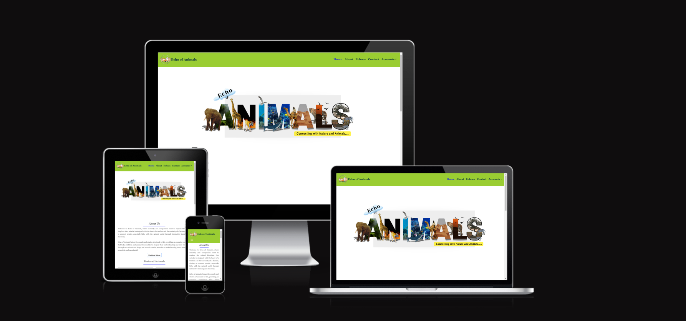
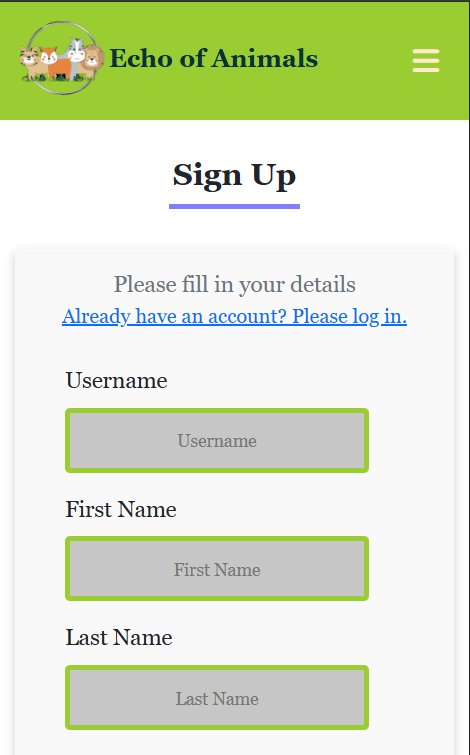
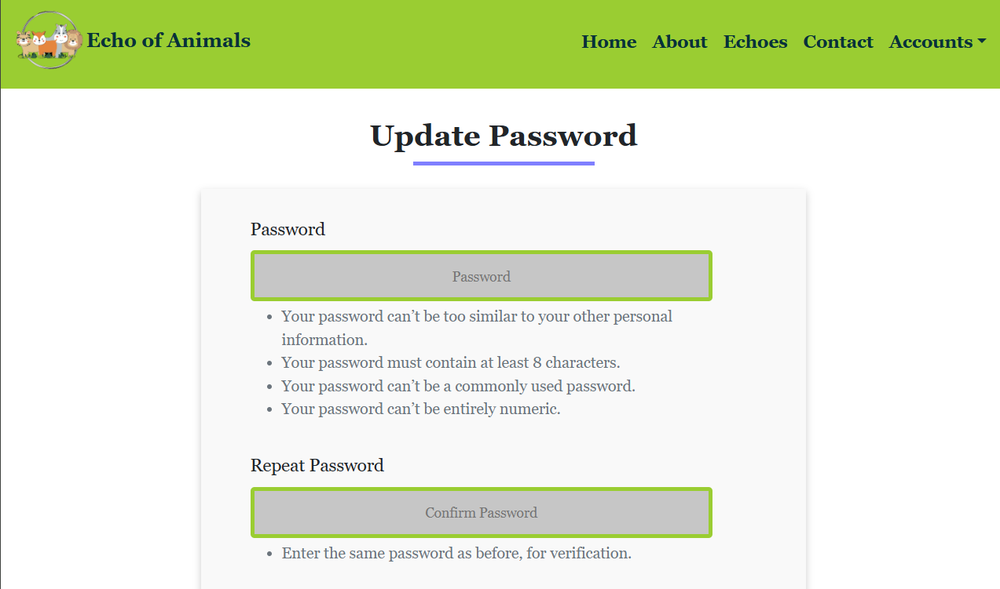

# Echo of Animals

**Echo of Animals** is a unique platform dedicated to helping children and animal enthusiasts learn more about animals through engaging blog posts and interactive audio experiences. This website serves as both an educational tool and a fun resource, designed to introduce kids to various animals and the sounds they make, fostering a deeper understanding and appreciation for the natural world.

Through **Echo of Animals**, users can explore a variety of blog posts on different animal species, their habitats, and fascinating traits, with the added feature of listening to the actual sounds made by these animals. This auditory experience not only supports children’s learning but also encourages curiosity about nature and wildlife.

- GitHub Profile: <https://github.com/klsoundarya/echo-of-animals>
- Deployed Site: <https://echo-animals-project-6ca0ed3f7e25.herokuapp.com/>
- For Admin access with relevant sign-in information: [Echo of Animals Admin Access (https://echo-animals-project-6ca0ed3f7e25.herokuapp.com/admin)]



,,,,,

<hr>

## Table of Contents

- [User Stories](#user-stories)
  - [First Time User Goals](#first-time-user-goals)
  - [Returning Site Users](#returning-site-users)
  - [Site Owner Goals](#site-owner-goals)
  - [Target Audience](#target-audience)
- [Wireframes](#wireframes)
  - [Mobile Wireframes](#mobile-wireframes)
  - [Laptop & Desktop Wireframes](#laptop--desktop-wireframes)
- [Deployment](#deployment)
  - [GitHub Pages](#github-pages)
  - [Django Project Setup](#django-project-setup)
  - [Cloudinary API](#cloudinary-api)
  - [PostgreSQL](#elephant-sql)
  - [Heroku deployment](#heroku-deployment)
  - [Forking](#forking)
  - [Making a Local Clone](#making-a-local-clone)
- [Testing](#testing)
- [Features](#features)
  - [Existing Features](#existing-features)
  - [Features to Implement](#features-to-implement)
- [Design](#design)
  - [UX](#ux)
  - [Typography](#typography)
  - [Gallery](#gallery)
  - [Color Scheme](#color-scheme)
- [Project Planning](#project-planning)
  - [Strategy Plane](#strategy-plane)
    - [Site Goals](#site-goals)
  - [Agile Methodologies - Project Management](#agile-methodologies-project-management)
    - [MoSCoW Prioritization](#moscow-prioritization)
    - [Sprints](#sprints)
  - [Scope Plane](#scope-plane)
  - [Structural Plane](#structural-plane)
  - [Skeleton \& Surface Planes](#skeleton-surface-planes)
    - [Database Schema - Entity Relationship Diagram](#database-schema---entity-relationship-diagram)
    - [Security](#security)
- [Credits](#credits)
  - [Tools & Technologies Used](#tools--technologies-used)
  - [Acknowledgments](#acknowledgements)
  - [Disclaimer](#disclaimer)

### User Stories

User stories and features recorded and managed on [GitHub Projects](<https://github.com/users/klsoundarya/projects/4>)

<!-- Some of the mentioned user stories have already been implemented, while the remaining ones are planned for future features. -->

<details>
<summary>User Goals</summary>
<br>

#### First time User Goals

- As a first-time user, I want to easily understand the purpose of the website and how it will help me (or my child) learn about animals and nature.
- As a first-time user, I would like to navigate quickly to content that allows me to listen to animal sounds and read blog posts for an engaging experience.
- As a first-time user, I am looking for an intuitive and accessible interface that makes it easy for kids to explore safely.

#### Returning Site Users

- As a returning site user, I want to discover new blog posts about animals or updated content to keep learning more about wildlife.
- As a returning site user, I would like to revisit and listen to the animal sounds my child enjoyed or search for new animals to add variety.
- As a returning site user, I want the site to save or suggest content based on my previous visits for a more personalized experience.

#### Site Owner Goals

- As the site owner, I want to provide accurate, engaging, and educational content to foster a love for animals and nature.
- As the site owner, I aim to design a safe, child-friendly interface that encourages curiosity and learning without overwhelming the user.
- As the site owner, I want to create a user-friendly system for easy content management, including blog posts, animal sound uploads, and user registration for interactive features.

### Target Audience

- Young learners and children (ages 4-10) who are curious about animals and enjoy interactive learning experiences.
- Parents and educators looking for safe, educational resources to introduce children to nature and wildlife.
- Animal enthusiasts of any age interested in exploring different species, their sounds, and habitats for educational or personal interest.

</details>

### Wireframes

I have used [Canva](https://www.canva.com/) to design my website wireframes for mobile, laptop and desktop screen sizes to see and work on my website designing.

### Mobile Wireframes
<!-- learnt the dropdown from https://dev.to/asyraf/how-to-add-dropdown-in-markdown-o78 -->
<!-- My website has evolved from the initial wireframes I created earlier in the project. While the design now looks different from the original plan, I see this as a natural progression as the project developed. The changes reflect new ideas and insights that came up during the development process, resulting in a structure that aligns better with the project’s goals. -->

<details>
<summary>Mobile Wireframes</summary>
<br>


</details>

### Laptop & Desktop Wireframes

<details>
<summary>Laptop & Desktop Wireframes</summary>
<br>


</details>

## Deployment

<details>
<summary>To create the project from scratch, fork or clone use the following steps...</summary>
<br>

To begin this project from scratch, you must first create a new GitHub repository using the [Code Institute's Template](https://github.com/Code-Institute-Org/ci-full-template). This template provides the relevant tools to get you started. To use this template:

1. Log in to [GitHub](https://github.com/) or create a new account.
2. Navigate to the above CI Full Template.
3. Click '**Use this template**' -> '**Create a new repository**'.
4. Choose a new repository name and click '**Create repository from template**'.
5. In your new repository space, (choice of your IDE) click the button to generate a new workspace.

## Django Project Setup

1. Install Django and supporting libraries: 
   
- ```pip3 install 'django<4.2.16' gunicorn```
- ```pip3 install dj_database_url psycopg2```
- ```pip3 install dj3-cloudinary-storage```  
  
2. Once you have installed any relevant dependencies or libraries, such as the ones listed above, it is important to create a **requirements.txt** file and add all installed libraries to it with the ```pip3 freeze --local > requirements.txt``` command in the terminal.  
3. Create a new Django project in the terminal ```django-admin startproject echo_animals .```
4. Create a new app example: ```python3 mangage.py startapp echoes```
5. Add this to list of **INSTALLED_APPS** in **settings.py** - 'echoes',
6. Create a superuser for the project to allow Admin access and enter credentials: ```python3 manage.py createsuperuser```
7. Migrate the changes with commands: ```python3 manage.py migrate```
8. An **env.py** file must be created to store all protected data such as the **DATABASE_URL**, **cloudinary** and **SECRET_KEY**. These may be called upon in your project's **settings.py** file along with your Database configurations. The **env.py** file must be added to your **gitignore** file so that your important, protected information is not pushed to public viewing on GitHub. For adding to **env.py**:

- ```import os```
- ```os.environ["DATABASE_URL"]="<copiedURLfromPostgreSQL>"```
- ```os.environ["SECRET_KEY"]="my_super^secret@key"```
  
For adding to **settings.py**:

- ```import os```
- ```import dj_database_url```
- ```if os.path.exists("env.py"):```
- ```import env```
- ```SECRET_KEY = os.environ.get('SECRET_KEY')``` (actual key hidden within env.py)  

9. Replace **DATABASES** with:

```
DATABASES = {
    'default': dj_database_url.parse(os.environ.get("DATABASE_URL"))
  }
```

10. Set up the templates directory in **settings.py**:
- Under ``BASE_DIR`` enter ``TEMPLATES_DIR = os.path.join(BASE_DIR, ‘templates’)``
- Update ``TEMPLATES = 'DIRS': [TEMPLATES_DIR]`` with:

```
os.path.join(BASE_DIR, 'templates'),
os.path.join(BASE_DIR, 'templates', 'allauth')
```

- Create the media, static and templates directories in top level of project file in IDE workspace.

11. A **Procfile** must be created within the project repo for Heroku deployment with the following placed within it: ```web: gunicorn echo_animals.wsgi```
12. Make the necessary migrations again.

## Cloudinary API 

Cloudinary provides a cloud hosting solution for media storage. All users uploaded images in the Echo of Animals project are hosted here.

Set up a new account at [Cloudinary](https://cloudinary.com/) and add your Cloudinary API environment variable to your **env.py** and Heroku Config Vars.
In your project workspace: 

- Add Cloudinary libraries to INSTALLED_APPS in settings.py 
- In the order: 
```
   'cloudinary_storage',  
   'django.contrib.staticfiles',  
   'cloudinary',
```
- Add to **env.py** and link up with **settings.py**: ```os.environ["CLOUDINARY_URL"]="cloudinary://...."``` 
- Set Cloudinary as storage for media and static files in settings.py:
- ```STATIC_URL = '/static/'```
```
  STATICFILES_STORAGE = 'cloudinary_storage.storage.StaticHashedCloudinaryStorage'  
  STATICFILES_DIRS = [os.path.join(BASE_DIR, 'static'), ]  
  STATIC_ROOT = os.path.join(BASE_DIR, 'staticfiles')‌  
  MEDIA_URL = '/media/'
  DEFAULT_FILE_STORAGE = 'cloudinary_storage.storage.MediaCloudinaryStorage'
```

## Deployment Process for PostgreSQL

To deploy **Echo of Animals** with PostgreSQL as the database, follow these steps:

A new database instance can be created from the [official website](https://www.postgresql.org/download/) for your project. 

#### 1. Configure PostgreSQL
   - Open the PostgreSQL command-line tool:
     ```bash
     sudo -u postgres psql
     ```
   - Create a new database:
     ```sql
     CREATE DATABASE echo_of_animals_db;
     ```
   - Create a new user with a password:
     ```sql
     CREATE USER echo_admin WITH PASSWORD 'your_password';
     ```
   - Grant the user access to the database:
     ```sql
     ALTER ROLE echo_admin SET client_encoding TO 'utf8';
     ALTER ROLE echo_admin SET default_transaction_isolation TO 'read committed';
     ALTER ROLE echo_admin SET timezone TO 'UTC';
     GRANT ALL PRIVILEGES ON DATABASE echo_of_animals_db TO echo_admin;
     ```
   - Exit the PostgreSQL prompt:
     ```sql
     \q
     ```

#### 2. Update Django Settings
   - In your Django project, go to `settings.py` and update the `DATABASES` setting:
     ```python
     DATABASES = {
         'default': {
             'ENGINE': 'django.db.backends.postgresql',
             'NAME': 'echo_of_animals_db',
             'USER': 'echo_admin',
             'PASSWORD': 'your_password',
             'HOST': 'localhost',  # or IP address if using a remote server
             'PORT': '5432',       # default PostgreSQL port
         }
     }
     ```

#### 3. Apply Migrations
   - Run migrations to create the necessary tables in the PostgreSQL database:
     ```bash
     python manage.py migrate
     ```

#### 4. Verify the Setup
   - Start your Django server:
     ```bash
     python manage.py runserver
     ```
   - Visit your site to verify that the database is working as expected.

- From your user dashboard, retrieve the important 'postgres://....' value. Place the value within your **DATABASE_URL**  in your **env.py** file and follow the below instructions to place it in your Heroku Config Vars.

## Heroku deployment

To start the deployment process , please follow the below steps:

1. Log in to [Heroku](https://id.heroku.com/login) or create an account if you are a new user.
2. Once logged in, in the Heroku Dashboard, navigate to the '**New**' button in the top, right corner, and select '**Create New App**'.
3. Enter an app name and choose your region. Click '**Create App**'. 
4. In the Deploy tab, click on the '**Settings**', reach the '**Config Vars**' section and click on '**Reveal Config Vars**'. Here you will enter KEY:VALUE pairs for the app to run successfully. The KEY:VALUE pairs that you will need are your: 
   
   - **CLOUDINARY_URL**: **cloudinary://....** 
   - **DATABASE_URL**:**postgres://...** 
   - **DISABLE_COLLECTSTATIC** of value '1' ( Remove this Config Var before deployment),
   -  **PORT**:**8000**
   -  **SECRET_KEY** and value  
  
5. Add the Heroku host name into **ALLOWED_HOSTS** in your projects **settings.py file** -> ```['herokuappname', ‘localhost’, ‘8000 port url’].```
6. Once you are sure that you have set up the required files including your requirements.txt and Procfile, you have ensured that **DEBUG=False**, save your project, add the files, commit for initial deployment and push the data to GitHub.
7. Go to the '**Deploy**' tab and choose GitHub as the Deployment method.
8. Search for the repository name, select the branch that you would like to build from, and connect it via the '**Connect**' button.
9.  Choose from '**Automatic**' or '**Manual**' deployment options, I chose the 'Manual' deployment method. Click '**Deploy Branch**'.
10. Once the waiting period for the app to build has finished, click the '**View**' link to bring you to your newly deployed site. If you receive any errors, Heroku will display a reason in the app build log for you to investigate. **DISABLE_COLLECTSTATIC**  may be removed from the Config Vars once you have saved and pushed an image within your project, as can **PORT:8000**.

#### Forking

By forking the GitHub Repository, we make a copy of the original repository on our GitHub account to view and/or make changes without affecting the original owner's repository.

You can fork this repository by using the following steps:

1. Log in to GitHub and locate the [echo-of-animals repository](https://github.com/klsoundarya/echo-of-animals)
2. At the top of the Repository (not top of page) just above the "Settings" Button on the menu, locate the "Fork" Button.
3. Once clicked, you should now have a copy of the original repository in your own GitHub account!

### Making a Local Clone

1. Log in to GitHub and locate the [echo-of-animals repository](https://github.com/klsoundarya/echo-of-animals)
2. Find the Code button situated above the file list and give it a click.
3. Choose your preferred cloning method — whether it's HTTPS, SSH, or GitHub and hit the copy button to copy the URL to your clipboard.
4. Launch Git Bash or Terminal.
5. Navigate to the directory where you want the cloned directory to reside.
6. In your IDE Terminal, input the following command to clone the repository:

> git clone <https://github.com/klsoundarya/echo-of-animals>

__Press Enter and your local clone will be created.__

7. Using the ``pip3 install -r requirements.txt`` command, the dependencies and libraries needed for **Echo of Animals** will be installed.
8. Set up your **env.py** file and from the above steps for Cloudinary and PostgreSQL, gather the Cloudinary API key and the PostgreSQL url for additon to your code.
9. Ensure that your **env.py** file is placed in your **.gitignore** file and follow the remaining steps in the above Django Project Setup section before pushing your code to GitHub.

</details>

## Testing
- For all testing, please refer to the [TESTING.md](TESTING.md) file.

## Features

<details>
<summary>Project Features</summary>
<br>

### Existing Features

**Home Page:**

- Displays a welcoming layout with featured animal posts, images, and essential navigation links.
- Offers quick access to the most popular or recently updated posts.

**About Page:**

- Provides information about the purpose of the website, its goals, and target audience.
- Includes details about the development and mission of "Echo of Animals."

**Echoes Page:**

- Lists posts related to animal facts, stories, and updates.
- Allows users to explore different animal-related content and view the latest blog entries.

**User-Submitted Posts:**

- A feature is given where it allow users to submit their own animal-related posts, subject to admin approval.

**Contact Page:**

- Contains a contact form for users to reach out to the website administrators.
- Displays relevant contact information, including email and social media links.

**Password Update:**

- Users can update their password via a secure form.
- Ensures password strength guidelines are followed (e.g., minimum length, no common passwords).

**Profile Update:**

- Allows users to update their personal information, including their name, email, and profile picture.
- Provides an option to change other user settings such as notification preferences.

**Login:**

- Authenticated users can log in to access personalized features like commenting, liking posts, and updating profiles.
- Supports username/email and password-based authentication.

**Logout:**

- Logged-in users can log out to end their session and return to the public view of login site.

- When links are broken users can see the custom error code for 400, 403, 404, 500 pages.

There are media query breakpoints used: 425px, 680px, 768px, above 1000px. This convenient feature allows users to easily access different sections of the website, making the browsing experience smoother and more efficient.

| Features        	| Desktop                                            	| Phone                                            	|
|-----------------	|----------------------------------------------------	|--------------------------------------------------	|
| Nav             	|            	|            	|
| Footer          	|      	|      	|
| Home            	|             	|             	|
| About           	|            	|            	|
| Echoes          	|           	|           	|
| Echoes-Footer   	|    	|    	|
| Contact         	|          	|          	|
| Log In          	|            	|            	|
| Log Out         	|           	|           	|
| Sign Up         	|          	|          	|
| Update Password 	|  	|  	|
| Update Profile  	|  	|  	|


## Features to Implement

**User Notifications:**

- Users will receive notifications for activity on their posts (e.g., replies to comments, likes on posts).
- Admin notifications for new user registrations or post submissions.

**Enhanced Profile Pages:**

- Profiles will display more detailed user information, such as submitted posts, most liked content, and comments.
- Users will have the ability to edit and delete their posts from their profile.

**Nested Comments:**

- Users will be able to reply to specific comments, creating a nested comment structure.
- Notifications will be sent when a user is replied to in the comment section.

**Animal Fun Facts Carousel:**

- A carousel of fun facts related to individual animals will be dynamically added to each animal post, enhancing user engagement with animal trivia.

**Tags for Posts:**

- Each animal post will include relevant tags for post pages, allowing users to easily find posts related to specific topics or animals.

</details>


### Credits

### Tools & Technologies Used

The following technologies were used in this overall project.

- My project is inspired from [code institute](https://learn.codeinstitute.net/) django blog Walkthrough Project.
- I used [Canva](https://www.canva.com/) to create the color scheme, readme images collage, favicon image, wireframes. Additionally, I used it to resize all images to a consistent size, and also [unsplash](https://unsplash.com/), [freepik](https://www.freepik.com/), [mdbootstrap](https://mdbootstrap.com/), [shutterstock](https://www.shutterstock.com/) and animal audio sounds from [Pixabay](https://pixabay.com/), [sounddino](https://sounddino.com/).
- [ChatGPT](https://chat.openai.com/), [Grammarly](https://app.grammarly.com/) and a [plagiarism checker](https://www.duplichecker.com/) is used to review the text, code and ensure there were no grammar or spelling mistakes.
- I used [Am I Responsive](https://ui.dev/amiresponsive) design to show my webiste in various screen sizes.
- [CI Python Linter](https://pep8ci.herokuapp.com/) is been used to check for the bugs
- I referred to resources such as [stack overflow](https://stackoverflow.com/), [W3Schools](https://www.w3schools.com/css/default.asp), [twilio](https://www.twilio.com/en-us/blog/build-contact-form-python-django-twilio-sendgrid), [freefrontend](https://freefrontend.dev/) for assistance in understanding code in few places and finding answers to questions relevant to my coding.
- [Django Docs](https://www.djangoproject.com/), [Bootstrap Docs](https://getbootstrap.com/docs/5.3/getting-started/introduction/) and [codemy.com](https://www.youtube.com/@Codemycom) used as the resources.
- [Visual Studio Code](https://code.visualstudio.com/) used as a remote code editor.
- [Gitpod Enterprise](https://www.gitpod.io/docs/enterprise) used as a cloud-based IDE for development.
- [GitHub](https://github.com) used for secure online code storage.
- [Heroku](https://www.heroku.com/) used for hosting the deployed back-end site.
- [Git](https://git-scm.com/) was used for version control by utilizing the command line terminal in VS code and GitPod enterprise to commit and Push to GitHub.
- Added high contrast text against the background color in many places, which improves readability for users with visual impairments.
- Focus [Bootstrap](https://getbootstrap.com/docs/5.0/getting-started/introduction/) styles are applied to interactive elements like links and buttons, making it easier for keyboard users to navigate your site.
- Used media queries and responsive design principles to ensure that website is accessible on a variety of devices, including mobile phones and tablets.
- [Favicon.io](https://favicon.io/favicon-converter/) is used to create the various favicon files for my website.
- [Font Awesome](https://fontawesome.com/) icons were used throughout my project.
- [cloud convert](https://cloudconvert.com/png-to-webp) was used to convert from PNG to webp.
- I utilized Font Joy and Google Fonts for font pairing and to visualize the look and feel of my website.

### Acknowledgements

- I want to express my gratitude to my Code Institute mentor, [Dick Vlaanderen](https://github.com/dickvla), for his invaluable support, encouragement, and feedback throughout this project.
- I would like to thank my Cohort Facilitator, [lewis](https://github.com/LewisMDillon), for guidance and support, providing us with the relevant learning materials, 
- I would like to thank my fellow teammates to be sharing their knowledge and
- I personally want to thank my partner for his critique review and unwavering support, belief, and feedback.

### Disclaimer

> I Used my previous project readme as a reference to write the documentation (my previous project link is: <https://github.com/klsoundarya/dice-quest> and <https://github.com/klsoundarya/mastermind-game>).