# Testing

This is the TESTING file for the [Echo of Animals](https://echo-animals-project-6ca0ed3f7e25.herokuapp.com/) website.

Return back to the [README.md](README.md) file.

## Testing Contents  
  
- [Testing](#testing)
  - [Manual Testing](#manual-testing)
  - [Validator Testing](#validator-testing)
    - [Manual Testing](#manual-testing)
    - [Lighthouse](#lighthouse)
    - [HTML](#html)
    - [CSS](#css)
    - [JavaScript](#javascript)
    - [Python](#python)
    - [Browser Compatibility](#browser-compatibility)
    - [Testing User Stories](#testing-user-stories)
  - [Bugs](#bugs)
    - [Unfixed Bugs](#unfixed-bugs)

### Manual Testing

| Page   | Action                                                 | Expected Behavior                                                                                                                                                                                                                                                                                                                                                                                                                | Pass/Fail |
|--------|--------------------------------------------------------|----------------------------------------------------------------------------------------------------------------------------------------------------------------------------------------------------------------------------------------------------------------------------------------------------------------------------------------------------------------------------------------------------------------------------------|-----------|
| Home   |     | The index page was manually tested and verified it includes a hero banner with the "Echo of Animals" image, followed by an "About Us" section with a "Find Out More" button linking to the About page. Below the About section, featured animal card images are displayed with a "Read More" button leading to individual animal blog posts. For unauthenticated users, a prompt message encouraging registration was tested, while logged-in users see a welcome message with an "Explore More" link directing to the Echoes blog area. | Pass      |
| About   |       |The about us app/page successfully displays an introduction about the application along with four beautifully presented animal images, ensuring an engaging and visually appealing user experience.                                                                      | Pass      |
| Echoes   |       | The Echoes app successfully displays blog posts for each individual animal, allowing users to read engaging content. Below the heading, a "Submit Blog Post" button is available, enabling users to submit posts for admin approval before being published in the app. Additionally, beneath the section displaying animal cards, a button is provided to access a slider showcasing fun facts about the animals.                                                    | Pass      |
| Contact |  | The Contact app displays a form requiring users to input their first name, last name, email, subject, and message, along with a "Submit" button. Beside the form, a GIF video is included to enhance user-friendliness and engagement.                                                                                                                                               | Pass      |

- Echo of Animals website is tested and verified with no issues in different browsers:
  
  - [Google Chrome](https://www.google.com/intl/en_in/chrome/)
  - [Mozilla Firefox](https://www.mozilla.org/en-US/firefox/)
  - [Microsoft Edge](https://www.microsoft.com/en-us/edge/welcome?form=MA13FJ)

- Echo of Animals webpage is tested and verified that my website is responsive in various screen devices by using Google chrome web developer tools
  
  - Laptop
  - Tablet
  - Large screen mobile
  - Desktop

### Validator Testing

All pages passed through the Lighthouse test

- [Lighthouse test for all Apps in Mobile](read-me/testing-validators/lighthouse-mobile/mobile-part-1.png)
- [Lighthouse test for all Apps in Mobile](read-me/testing-validators/lighthouse-mobile/mobile-part-2.png)
- [Lighthouse test for all Apps in Mobile](read-me/testing-validators/lighthouse-mobile/mobile-part-3.png)

- [Lighthouse test for all Apps in Desktop](read-me/testing-validators/lighthouse-desktop/desktop-part-1.png)
- [Lighthouse test for all Apps in Desktop](read-me/testing-validators/lighthouse-desktop/desktop-part-2.png)
- [Lighthouse test for all Apps in Desktop](read-me/testing-validators/lighthouse-desktop/desktop-part-3.png)

### HTML

All pages have passed through the [W3 Markup HTML Validator](https://validator.w3.org/). I navigated to each page of the deployed site and used the "View Page Source" option to access the HTML code, and validated it in the W3C Markup HTML Validator.

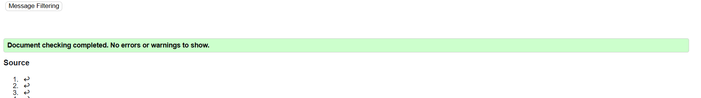

### CSS

CSS stylesheet have passed through the [W3 CSS Validator](https://jigsaw.w3.org/css-validator/)

### JS Hint

JSHint was used to look for errors in comment.js. No errors found.

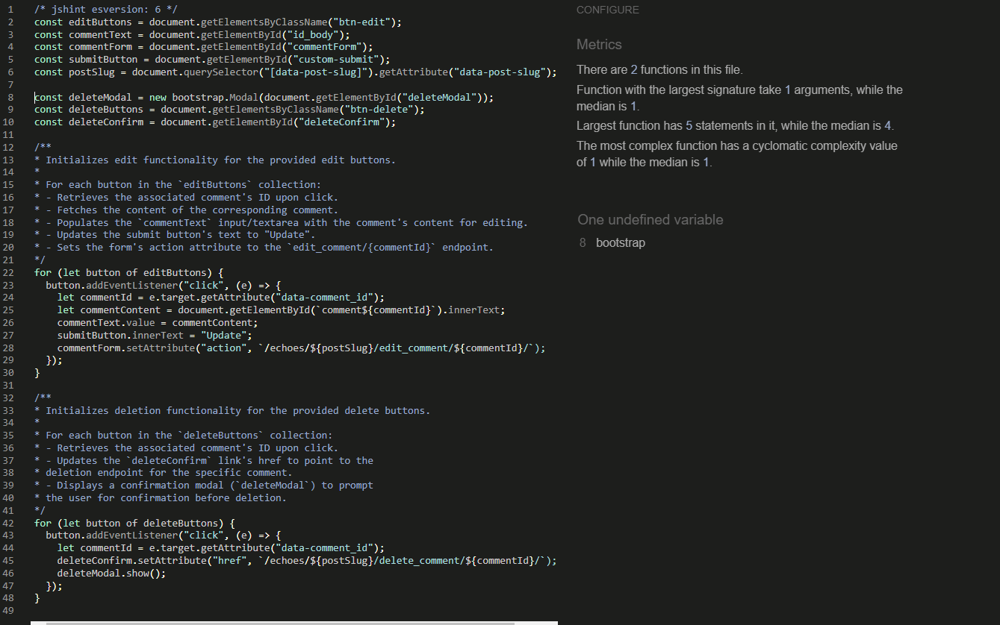
  

### Python

[CI Python Linter](https://pep8ci.herokuapp.com/#) was used to validate the Python files. Couldn't able to adjust the long characters. I have included some screenshots with the results below.

| Features 	| models.py                                                                   	| test_forms.py                                                                    	| forms.py                                                                      	| test_views.py                                                                   	| views.py                                                                     	| admin.py                                                               	| urls.py                                                                     	|
|----------	|-----------------------------------------------------------------------------	|----------------------------------------------------------------------------------	|-------------------------------------------------------------------------------	|---------------------------------------------------------------------------------	|------------------------------------------------------------------------------	|------------------------------------------------------------------------	|-----------------------------------------------------------------------------	|
| Home     	| N/A                                                                         	| N/A                                                                              	| N/A                                                                           	| N/A                                                                             	| 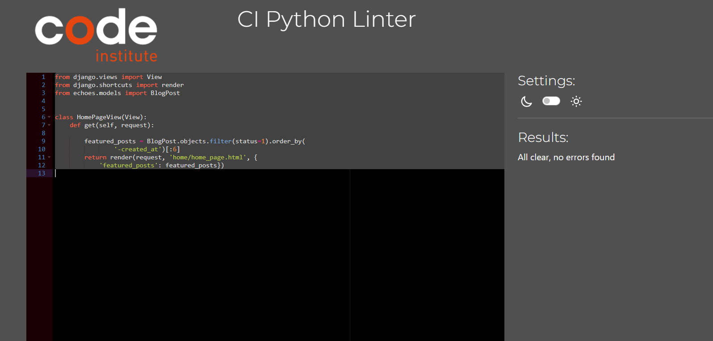           	| N/A                                                                    	| 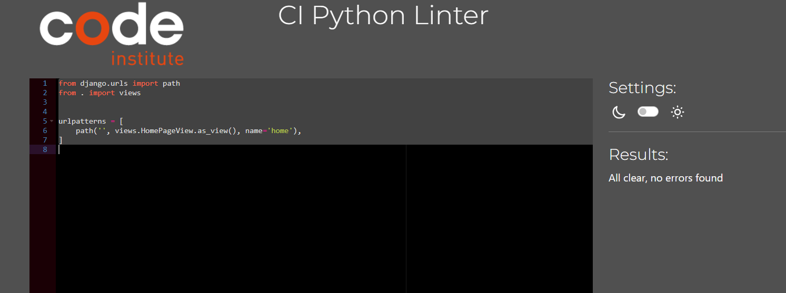           	|
| About    	| N/A                                                                         	| N/A                                                                              	| N/A                                                                           	| N/A                                                                             	| 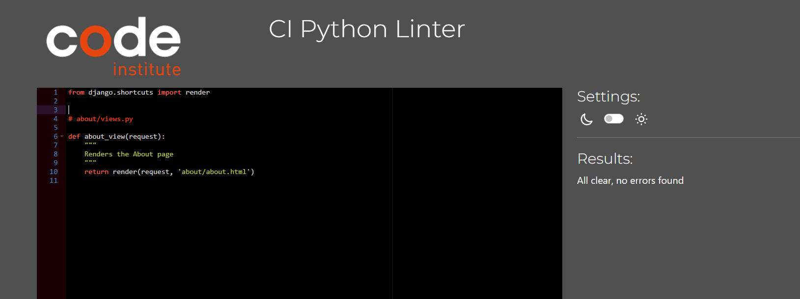          	| N/A                                                                    	| no errors found                                                                 	|
| Echoes   	| 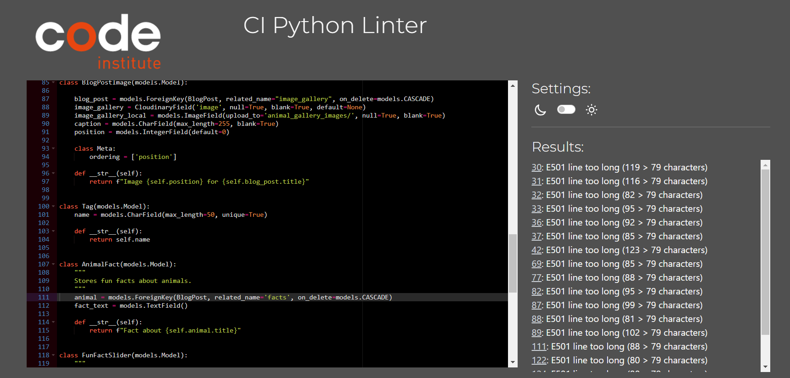 	| 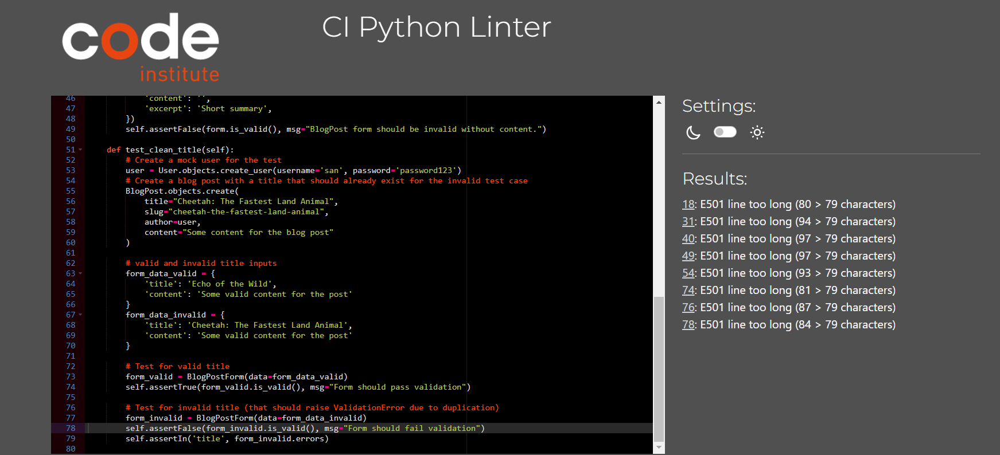 	| 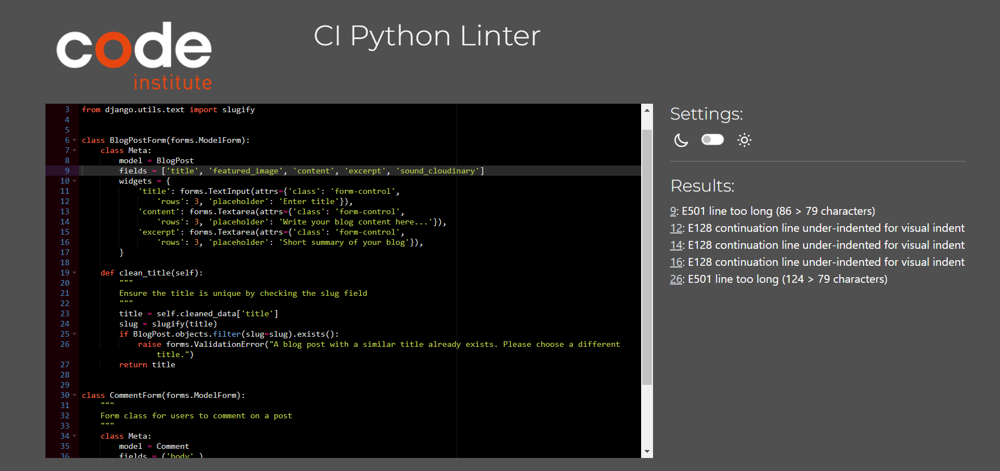  	| 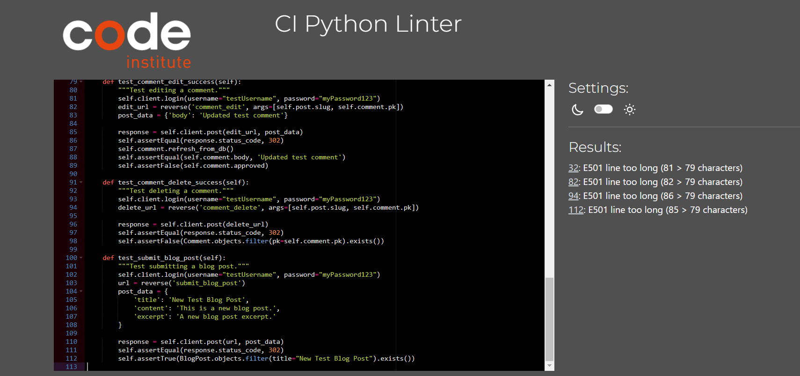 	| 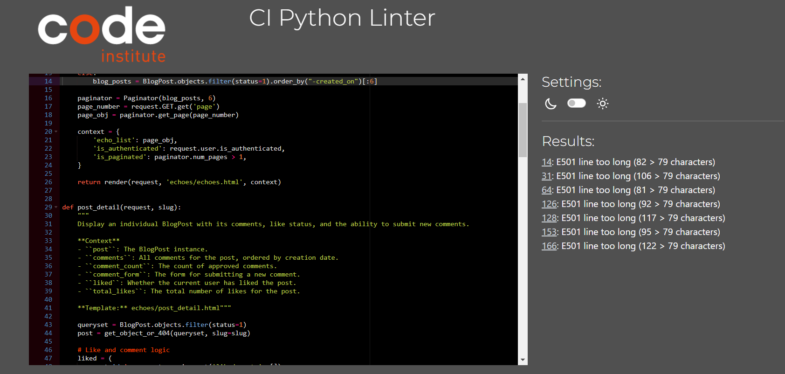   	| 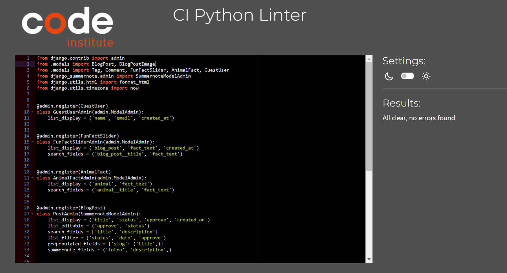  	| 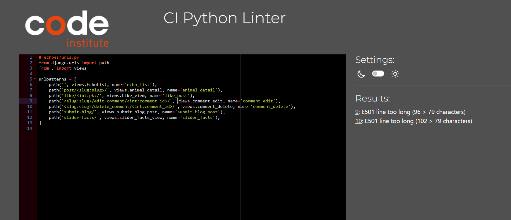   	|
| Contact  	| no errors found                                                                	| 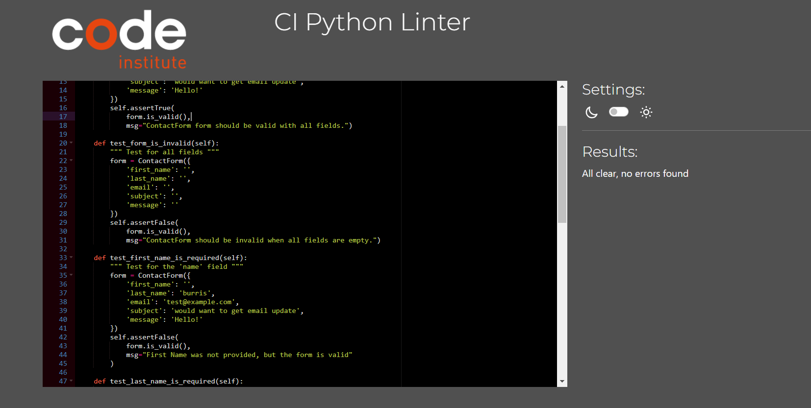              	| 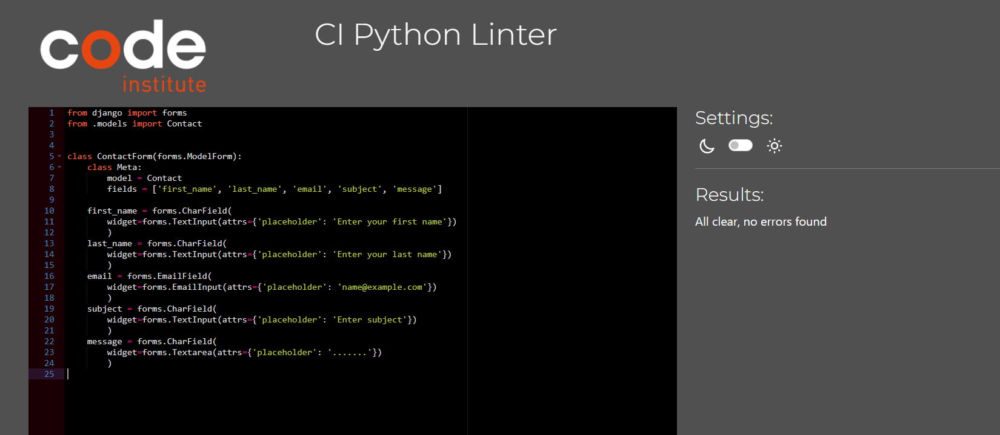        	| N/A                                                                             	| 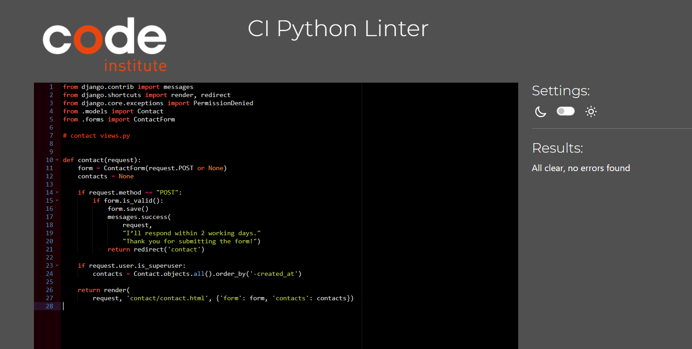        	| 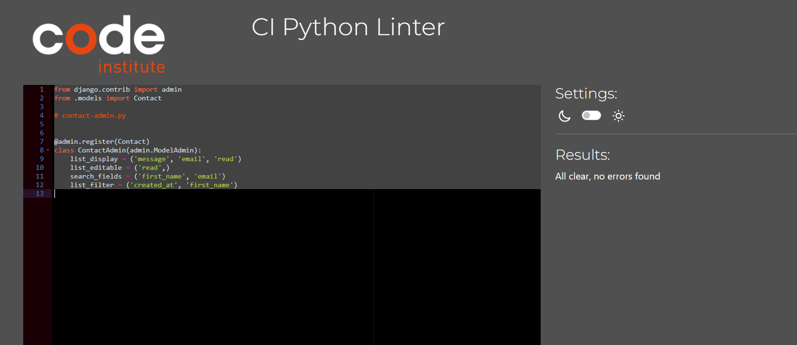 	| no errors found                                                                 	|
| Accounts 	| N/A                                                                         	| N/A                                                                              	| 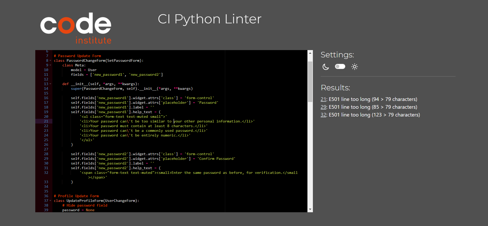 	| N/A                                                                             	| 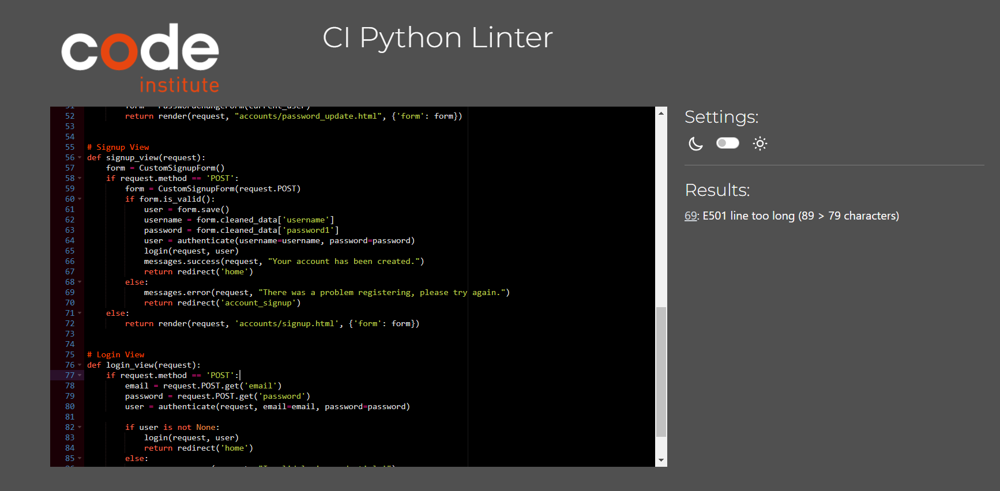 	| no errors found                                                              	| 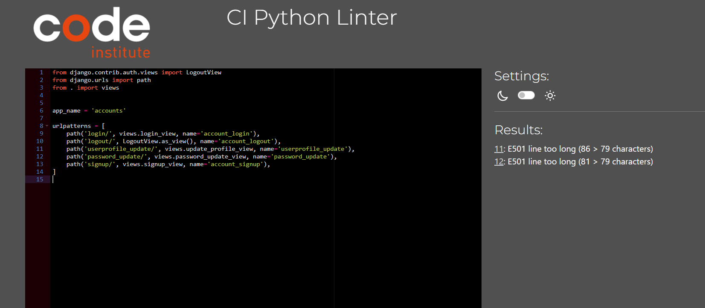 	|

### Testing User Stories

User Stories are documented in the Echo of Animals [GitHub Projects Board](https://github.com/users/klsoundarya/projects/4). User Stories are numbered, with Acceptance Criteria and Tasks detailed within. All features were tested to ensure that they provided the user with the expected output and action.

| User Story                    	| Acceptance Criteria Met? 	| Pass/Fail 	|
|-------------------------------	|--------------------------	|-----------	|
| Home                          	| Yes                      	| Pass      	|
| Navigation                    	| Yes                      	| Pass      	|
| Footer                        	| yes                      	| Pass      	|
| Featured Images               	| Yes                      	| Pass      	|
| Register Page                 	| Yes                      	| Pass      	|
| Login Page                    	| Yes                      	| Pass      	|
| Logout Page                   	| Yes                      	| Pass      	|
| Update Profile                	| Yes                      	| Pass      	|
| Update Password               	| Yes                      	| Pass      	|
| Contact Page                  	| Yes                      	| Pass      	|
| About Page                    	| Yes                      	| Pass      	|
| Echoes Page                   	| Yes                      	| Pass      	|
| Post Blog Form                	| Yes                      	| Pass      	|
| Add Picture in Posts          	| Yes                      	| Pass      	|
| Add audio sound in Posts      	| Yes                      	| Pass      	|
| Add Like Button to Toggle     	| Yes                      	| Pass      	|
| Add Comment Section           	| Yes                      	| Pass      	|
| Create Model Fields for Posts 	| Yes                      	| Pass      	|
| Add Tags                      	| Yes                      	| Pass      	|
| Add Animal Facts              	| Yes                      	|           	|

### Bugs